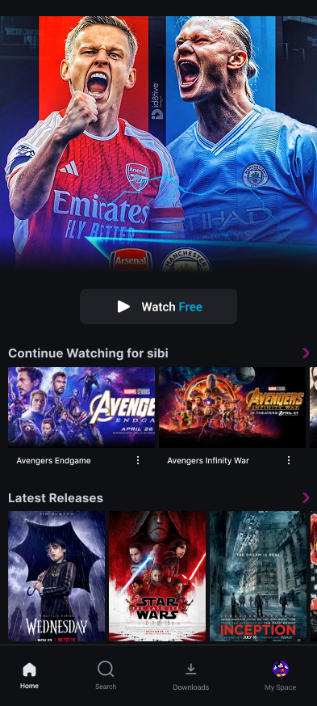
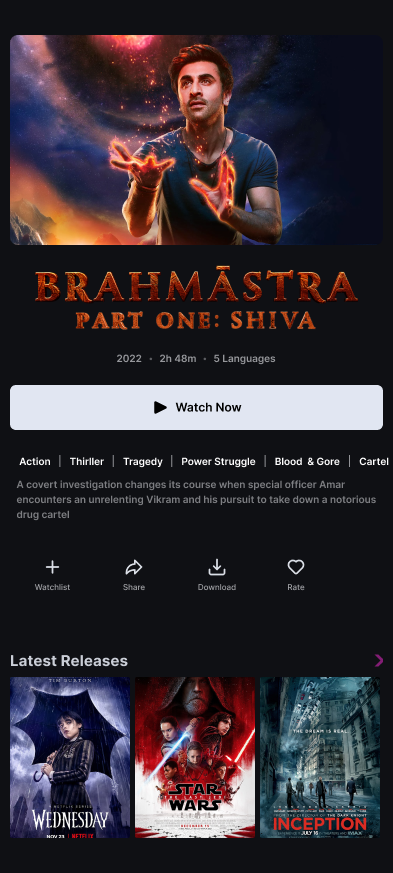
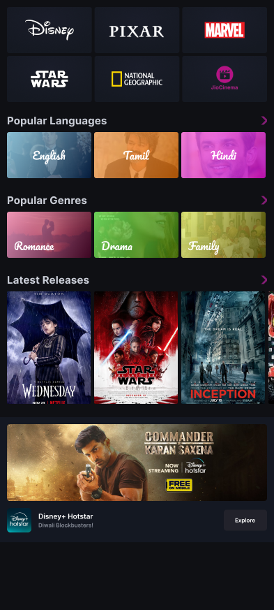
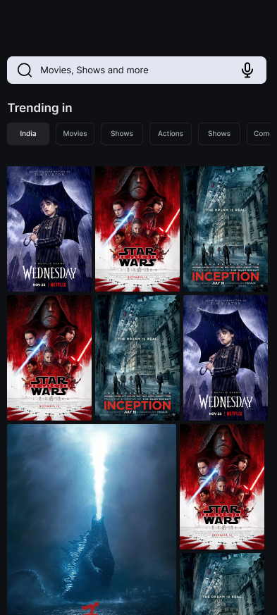
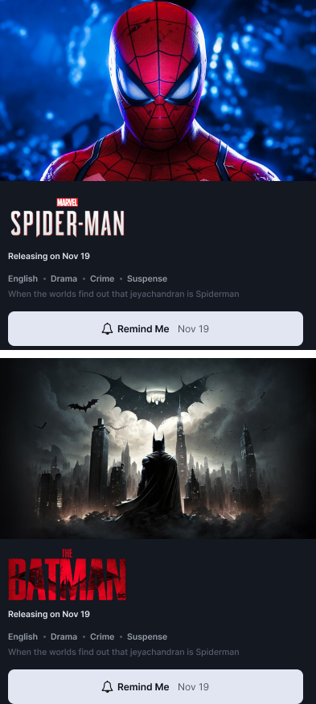
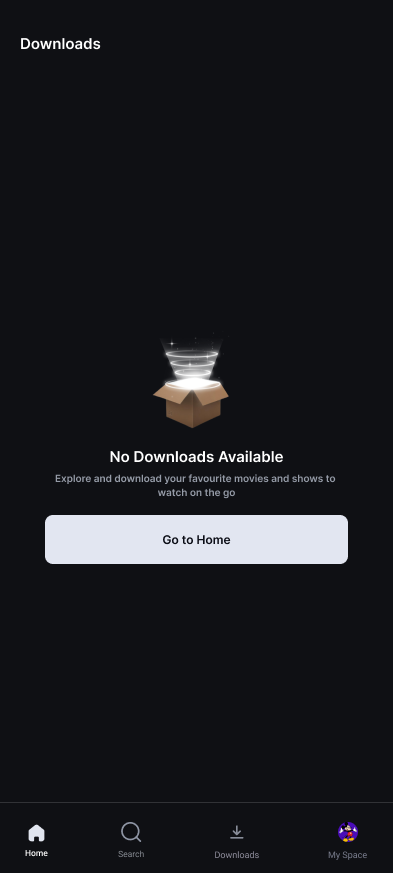
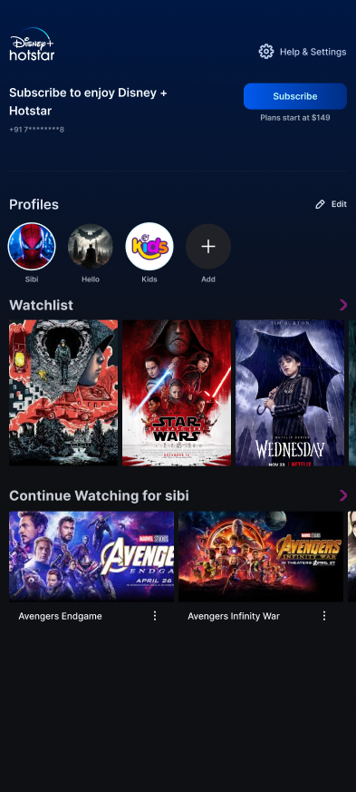
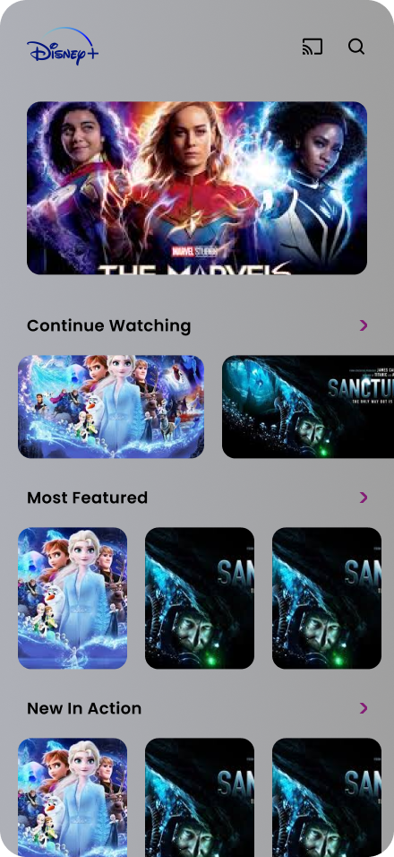

# 🎬 Hotstar Clone - Flutter Edition 🚀

> **"Why watch when you can build?"** 😉

Welcome to the **Hotstar Clone**, where pixels come to life and your device gets a taste of cinematic magic! A playground for experimentation, creativity, and Flutter fun.  

---

## 📢 About This Project

**Curiosity meets code!** This experimental Hotstar clone is built with **Dart & Flutter**, featuring a sleek UI and powerful performance. Not a polished product—expect creative chaos!  

🔔 **Heads Up:**  
> [!IMPORTANT]  
> This repo is a testing ground. Brace yourself for surprises and wild experiments! 🎭  

---

## 🖼 Screenshots  

**Sneak Peek of the Magic** ✨  

<div align="center">  

|  |  |  |
|:---:|:---:|:---:|
| *Home Screen* | *Content Preview* | *Categories* |

|  |  |  |
|:---:|:---:|:---:|
| *Search Page* | *I dont know what is this page* | *Download Page* |

|  |  |
|:---:|:---:|
| *Profile* | *Just an another ui* |  

</div>  

⚠️ **Warning:**  
> [!CAUTION]  
> Some experiments might push your GPU. Monitor FPS to avoid device meltdown! 🥵  

---

## 🛠 Features  

- ✅ **Sleek & Modern UI** 🎨  
- ✅ **Dynamic Content Loading** 📡  
- ✅ **Blazing-Fast Performance** ⚡  
- ✅ **Dark Theme Support** 🌑  
- ✅ **Surprise Elements** 🎭 *(Because who doesn’t love a plot twist?)*  

💡 **Pro Tip:**  
> [!TIP]  
> Use a dark editor theme. Bright themes + 3D debugging = instant regret. 😵‍💫  

---

## 🚀 Getting Started  

1. **Clone the Repo**  
```bash
git clone https://github.com/Yuslash/hotstar-app.git
cd hotstar-app/hotstar
```

2. **Install Dependencies**  
```bash
flutter pub get
```

3. **Run the App**  
```bash
flutter run
```

🖥️ **Pro Tip:** Enable hardware acceleration for smoother rendering!

---

📌 **Important Notes**
- **Experimental Codebase:** Expect breaking changes and wild experiments.
- **Not Production-Ready:** Use as a learning resource or inspiration.
- **Community-Driven:** PRs and issues are welcome!

---

🤝 **Contributing**  
Found a bug? Have a feature idea?

- 🪲 Open an [Issue](https://github.com/Yuslash/hotstar-app/issues)
- 🛠️ Submit a [PR](https://github.com/Yuslash/hotstar-app/pulls)
- 🌟 Star the Repo (If you like it!)

---
Go wild with it! Modify, distribute, and experiment—just don’t blame me if you fall in love with Flutter. 😆
